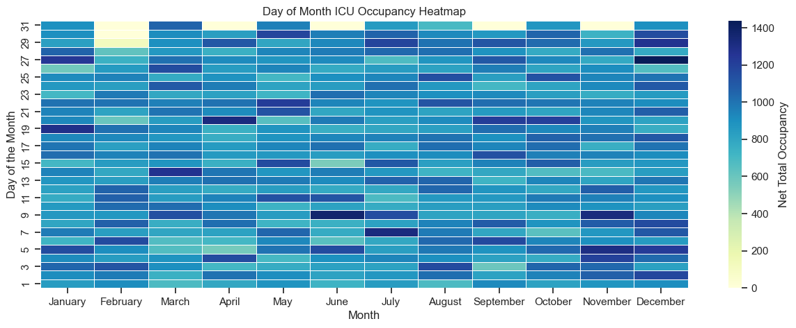
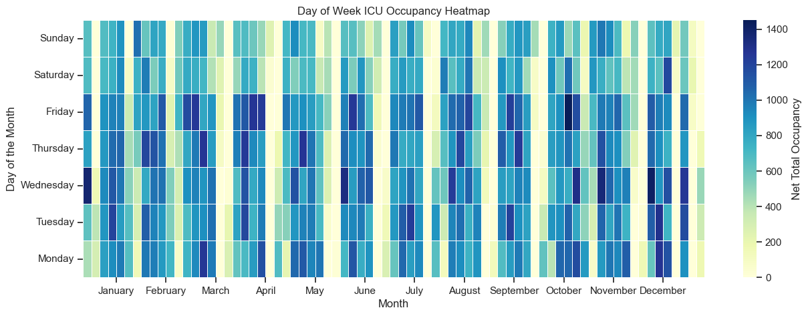
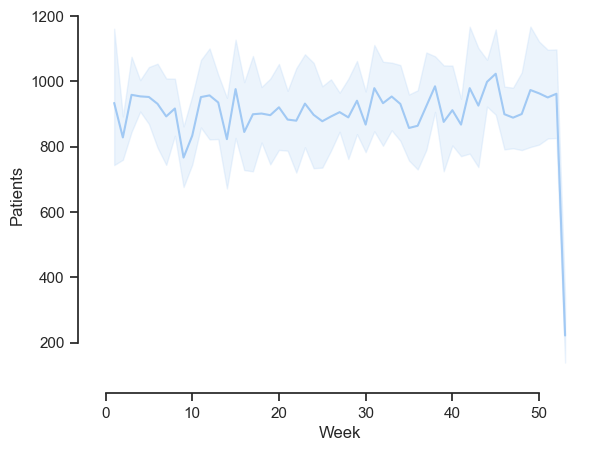
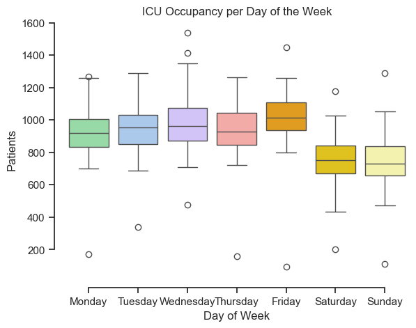
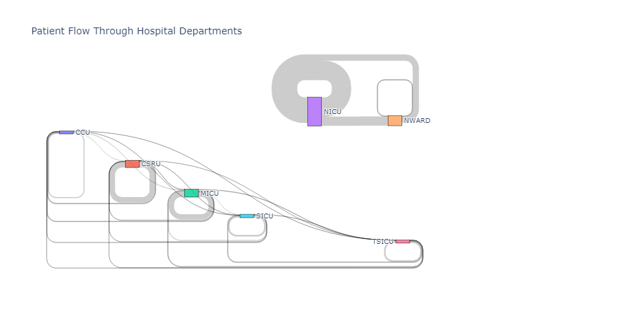

# **MIMIC-III-Visuals**
MIMIC Visualization | AI in Healthcare - UT MSAI

---
## **Heatmap of Cumulative ICU Occupancy Year-round**

No visible patterns or trends. Notice that February is missing some days at the end, so that’s a positive sniff test.

This graph is generated from `sns.heatmap()`

---
## **heatmap of Cumulative ICU Occupancy of the Day of Week**

The stripe pattern is due to unalignment of the days of weeks in each month, unable to match the continuity of the heatmap. However, notice that weekends show less occupancy.

This graph is generated from `sns.heatmap()`

---
## **Cumulative ICU Occupancy Year-round by Week**

No visible patterns or trends. That’s a strange dip at the end, not sure why.

This graph is generated from `sns.lineplot()`

---
## **Heatmap of Cumulative ICU Occupancy Year-round**

It seems that weekdays see more patients occupying ICUs whereas weekends drop-off in ICU admits.

This graph was generated using `sns.boxplot()`

---
## **Heatmap of Cumulative ICU Occupancy Year-round**

Neonatal ICU and Neonatal Ward are densely connected and CCU, CSRU, MICU, SICU, TSICU are connected. NICU, NWARD, CSRU, and MICU have relatively more traffic.

This diagram was produced by `ploty.graph_objects.Sankey()`
